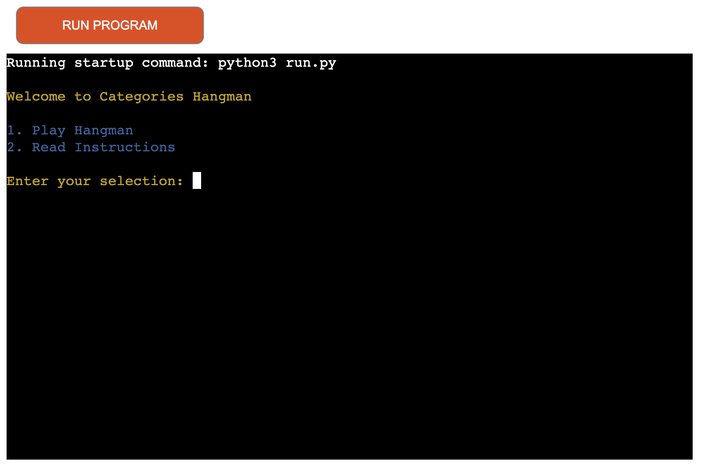
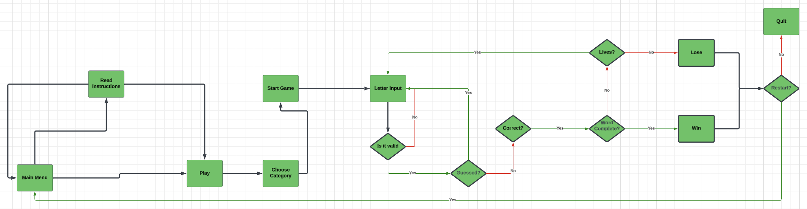
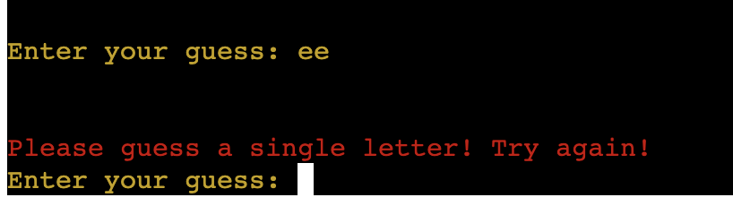
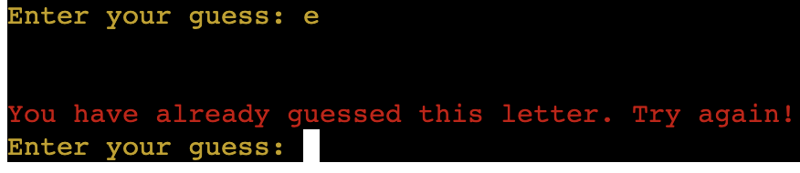
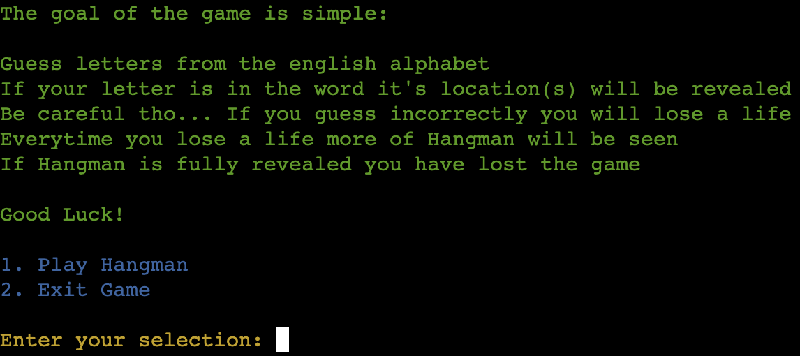
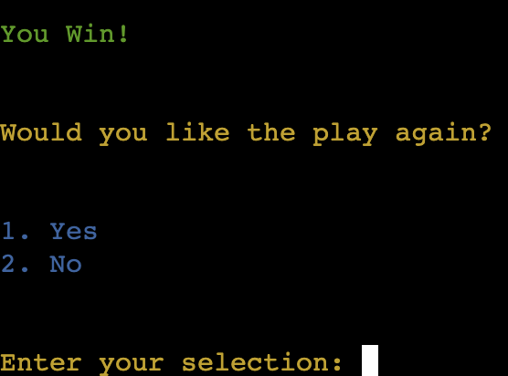
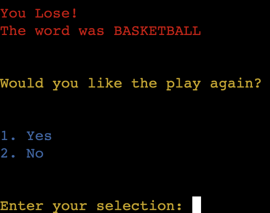

# Category Hangman

Category Hangman is a fun terminl game that runs on Heroku. It uses python to bring you an interactive game where you can choose your own category where you guess a randomly selected word from that category!

## Running The Application

To run the application the steps are as follows:

- You can load acces it on Heroku with this link [Hangman](https://category-hangman-e049c70ad3f3.herokuapp.com/)
- Upon accessing you will be prompted to either play the game or to read the instructions
- When ready to play enter the correct prompt required
- Choose your category. You can do this by entering the number associated with your choice.
- Guess a letter.
- Correct guesses will show up for you to see what position(s) they are in the word
- Incorrect guesses will draw more of Hangman and lose a life
- When Hangman is fully drawn and all lives are lost you have lost the game
- If all letters are guessed before losing you win the game
- Upon win or loss you will be prompted to play again or exit the game

## Design and Features

For the aesthetic of the game I used the colorama python library to add color to my terminal text.

To help envision the flow of the game before creating it I used LucidChart to create a flowchart

### Error Reading

The game makes sure the data you input at prompts will always be in a valid and the correct format and will display an error message and ask for the input again if otherwise. I achieved this with while loops, try statements, and if and for statements, giving the input guidelines to meet. eg. Input while guessing letter for hangman has to be a sting that is only one letter long. It also has to be a letter that hasnt already been guessed.

### Instructions menu

In the main menu, before running the main game and choosing your category you also have the option to check the game instructions on a seperate screen. From here you can return to the main menu or exit the program.

### Win / Lose condition

When the program detects all letters of the word correctly guessed before all lives are used up you are awarded with a message to let you know you have won. The game will prompt you to play again or exit the program.

When all lives are used up and hangman is complete before all letters are correctly guessed the game will be over and you will be greeted with a loss message. The word will also be revealed to you. Similarly to the win you will be prompted to play again or exit the program.

## Testing

- For manual testing I made sure to enter all the differentr menus of the game on multiple occasions in different orders to make sure everything was - loading correctly.
- I intentionally input incorrect data to user prompts to make sure my data validation was correct.
- I tested my code in the PEP8 Python Validator and refactored until it passed. (Note: There are no errors in the program however there are 4 warning messages for backslashes used in the graphics for the hangman stick figure.)

## Deployment and Technologies

- I used Visual Studio Code as my IDE
- I used git and github as version control
- I deployed my project using Heroku
- The heroku deployment can be accessed [here](https://category-hangman-e049c70ad3f3.herokuapp.com/)
- The depositary can be cloned with the cloned with [this](https://github.com/22kszov/category_hangman?tab=readme-ov-file) link.
  Just click on the green code button, copy the link and use it to clone the repositary in your own IDE

## Credits

I used this blog to get and understanding of the structure of the game. [hangman-resource](https://codefather.tech/blog/hangman-game-python/)
I directly pasted my hangman graphics from a stack overflow post to which the link is commented above in the code itself.
